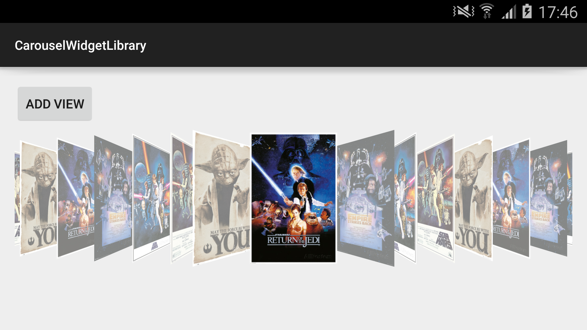

CarouselWidget
=============
### Description
Android CarouselWidget widget with demo.
Forked from [applm/CarouselWidget](https://github.com/applm/CarouselWidget).

### Screenshot

### Quick Start

You just need to add the following dependency to your `build.gradle`:

	repositories {
	    maven { url "https://jitpack.io" }
	}
	
	dependencies {
        compile 'com.github.kibotu:CarouselWidget:SNAPSHOT'
    }